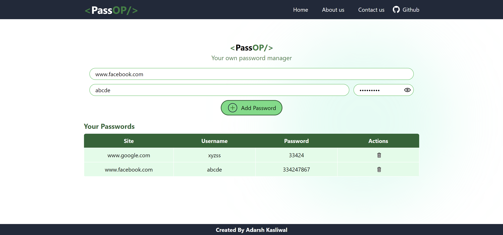

# Password Manager

Welcome to the **Password Manager** project! This application allows users to securely generate and manage their passwords.

## Features
- **Password Generation**: Easily create strong, random passwords.
- **Password Storage**: Safely store and retrieve your passwords.
- **User-Friendly Interface**: Intuitive design for a seamless experience.
- **Responsive Design**: Works well on both desktop and mobile devices.

## Installation
1. Clone the repository:
   ```bash
   git clone https://github.com/adarshkasliwal/Password-Manager.git
   ```
2. Navigate to the project directory:
   ```bash
   cd Password-Manager
   ```
3. Open the application in your preferred web browser to view the application.

## Technologies Used
- HTML
- CSS
- JavaScript
- React

## Screenshot
 

## Contributing
Feel free to fork the repository and submit pull requests. For major changes, please open an issue first to discuss what you would like to change.

## License
This project is licensed under the MIT License - see the LICENSE file for details.

## Acknowledgements
Inspired by the need for secure password management and various online resources for implementation.
